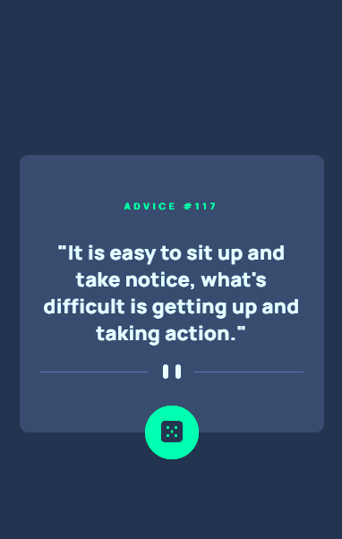
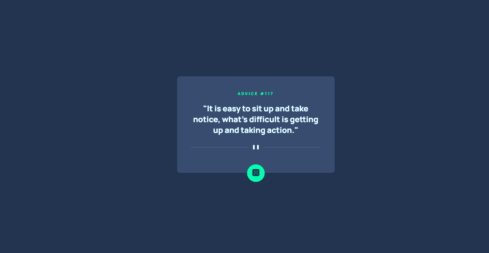

# Frontend Mentor - Advice generator app solution

Esta é uma solução para o desafio [Advice generator app](https://www.frontendmentor.io/challenges/advice-generator-app-QdUG-13db) do Frontend Mentor. Os desafios do Frontend Mentor ajudam você a melhorar suas habilidades de programação construindo projetos realistas.

## Sumário

- [Frontend Mentor - Advice generator app solution](#frontend-mentor---advice-generator-app-solution)
  - [Sumário](#sumário)
  - [Visão geral](#visão-geral)
    - [O desafio](#o-desafio)
    - [Screenshot](#screenshot)
    - [Links](#links)
  - [Meu processo](#meu-processo)
    - [Construído com](#construído-com)
    - [O que eu aprendi](#o-que-eu-aprendi)

## Visão geral

### O desafio

Os usuários devem conseguir:

- Ver o layout ideal da aplicação dependendo do tamanho de tela do dispositivo
- Ver estados de hover para todos os elementos interativos na página
- Gerar um novo conselho ao clicar no ícone do dado

> Observação: nesta versão atual do projeto, a implementação está focada no **layout (HTML + CSS)**. A parte de **JavaScript/API** será adicionada posteriormente.

### Screenshot





### Links

- Repositório: https://github.com/wellfefe/Advice-Generator
- URL do site ao vivo: https://wellfefe.github.io/Advice-Generator/

## Meu processo

### Construído com

- Marcação HTML5 semântica
- Propriedades customizadas do CSS (CSS Variables)
- Flexbox
- Media queries para responsividade

> Observação: React/Next/Styled Components não foram usados nesta versão (estrutura simples em HTML/CSS).

### O que eu aprendi

Neste projeto, pratiquei a construção de um card responsivo e o alinhamento centralizado na tela usando Flexbox. Também reforcei conceitos de responsividade usando `max-width` com `width: 100%` para o container se adaptar bem em diferentes resoluções.

Exemplo de CSS para manter o card responsivo:

```css
.generator-card {
  width: 100%;
  max-width: 540px;
}
```
Exemplo de centralização vertical e horizontal:

```css
main {
  display: flex;
  justify-content: center;
  align-items: center;
  min-height: 100vh;
}
```

Desenvolvimento contínuo
Próximos passos que pretendo implementar:

Adicionar JavaScript para buscar e atualizar os conselhos dinamicamente

Integrar com a Advice Slip API

Refinar acessibilidade (foco visível no teclado e estados :focus-visible)

Melhorar a tipografia responsiva usando clamp()

Recursos úteis
MDN - Flexbox — Referência para alinhamento, eixos e espaçamentos com Flexbox.

MDN - CSS Variables — Para entender e organizar variáveis no CSS.

Autor
GitHub - [@wellfefe](https://github.com/wellfefe)

Frontend Mentor - [@wellfefe](https://www.frontendmentor.io/profile/wellfefe)

Agradecimentos
Agradeço ao Frontend Mentor pelo desafio e por disponibilizar projetos com foco em prática e melhoria contínua e agradeço tambem ao Devemdobro pelas aulas e ajudas da comunidade.